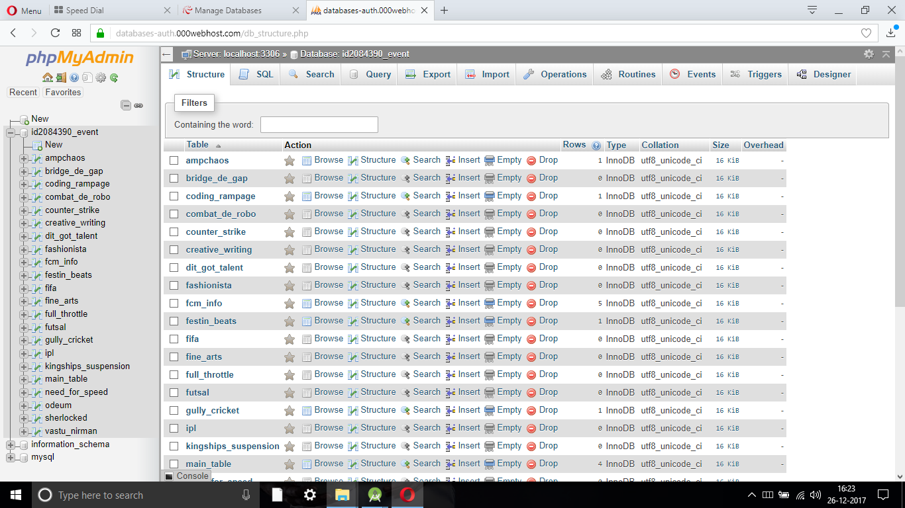
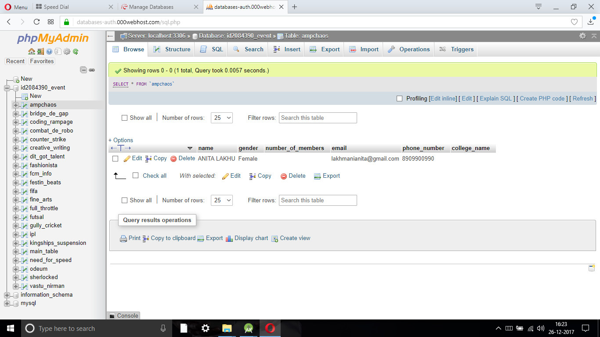

# Youthopia Files
<h4>Server on 000webhost with PHP and MYSQL in Backend Support</h4>
To Update the Server with new Details I have simple Used a JSON file to fetch the Data.
 
In case of any changes in Schedules or Events..The Admin will update the files and User will be Updated.
<h1>MYSQL Database Structure</h1>
<h4>Tables info</h4>

<h4>Event Table</h4>

